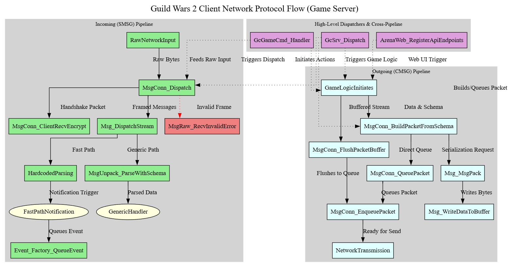

# KX Packet Inspector Documentation

Welcome to the official documentation for the KX Packet Inspector project.

This repository aims to provide a powerful tool for understanding and analyzing network communication in Guild Wars 2. This documentation serves as a central hub for all reverse engineering findings, methodologies, and technical insights gained during the development of this tool.

## Network Protocol Flow Diagram

For a high-level visual overview of the client's network communication with the Game Server, refer to the diagram below:

## Core Documentation

*   **[System Architecture](./system-architecture.md):** A high-level overview of the entire network message processing system, covering the three-server architecture (Login, Platform, Game) and detailing both incoming (SMSG) and outgoing (CMSG) packet pipelines.

*   **Game Server Packets:** Detailed, evidence-backed analysis of specific packet families and their variants. This section is the primary reference for all reverse-engineered network messages.
    *   **[Server-to-Client (SMSG) Packets](./protocols/game/smsg/README.md)**
    *   **[Client-to-Server (CMSG) Packets](./protocols/game/cmsg/README.md)**

*   **[Methodologies](./methodologies/README.md):** Guides and playbooks for reverse engineering the game client. These documents provide the step-by-step processes used to discover the information in this repository.

*   **[Architectural Evidence](./architectural_evidence/README.md):** Organized raw decompiled code snippets used as direct evidence for the architectural descriptions and packet analyses.

## Getting Started & Common Workflows

*   **To understand the overall network architecture, start with [System Architecture](./system-architecture.md).**
*   To find a specific packet, see the main **[Game Protocol Reference](./protocols/game/README.md)**.
*   For the step-by-step process of discovering new packets, consult the **[Discovery Playbooks](./methodologies/discovery_playbooks/README.md)**.
*   For a guide on recovering function names from the executable, see **[Function Naming from Assert Strings](./methodologies/function-naming-from-assert-strings.md)**.

We hope this documentation provides valuable insights and aids in your exploration of Guild Wars 2's internals.